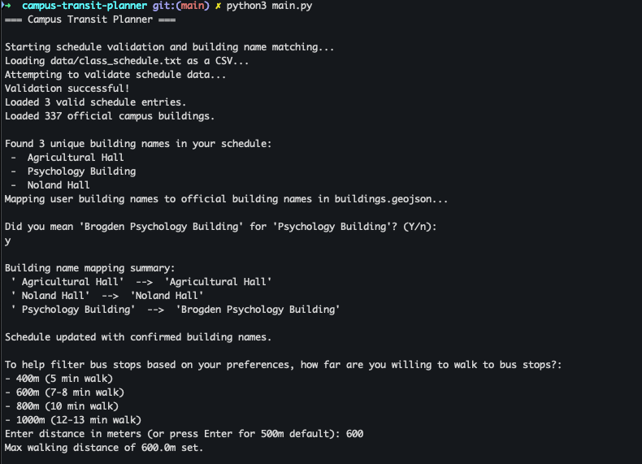
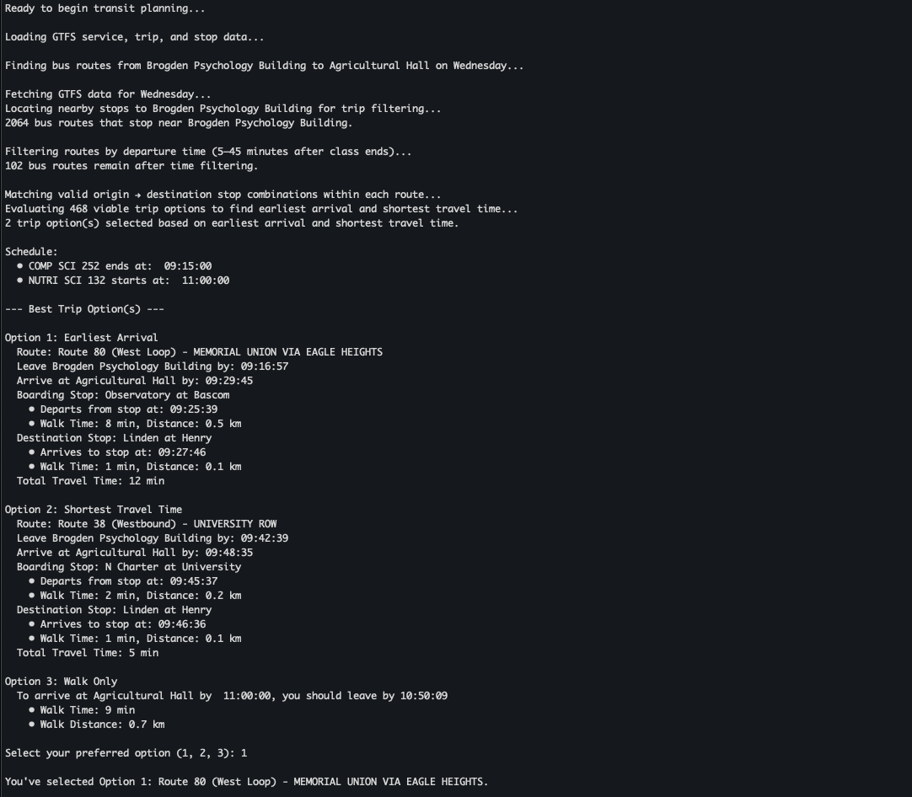
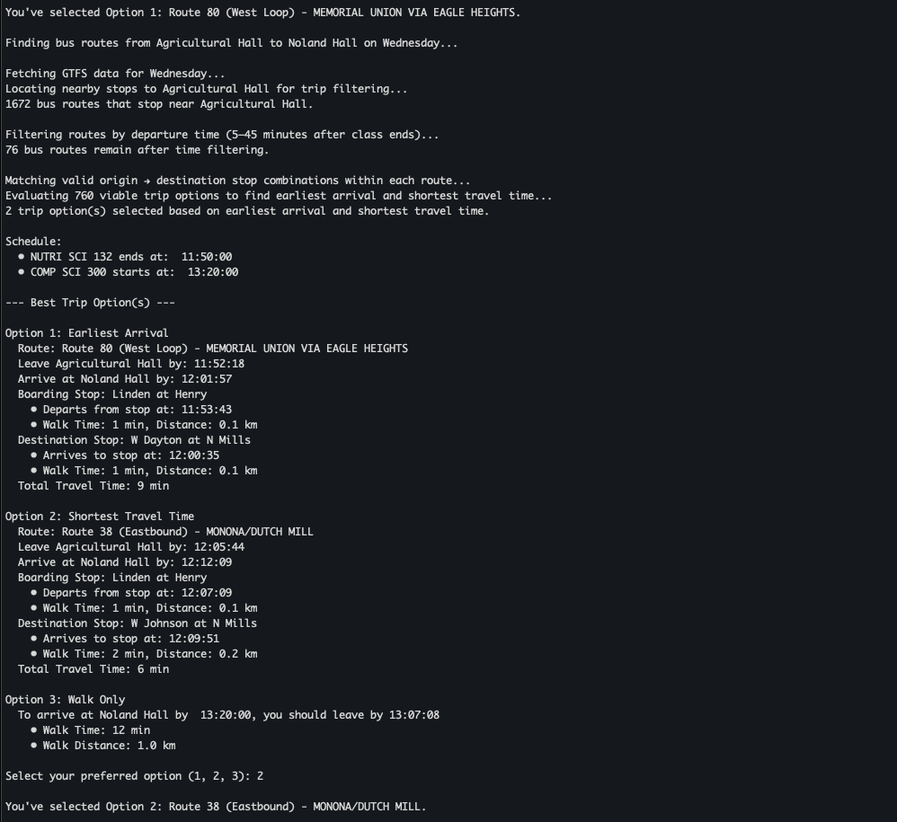
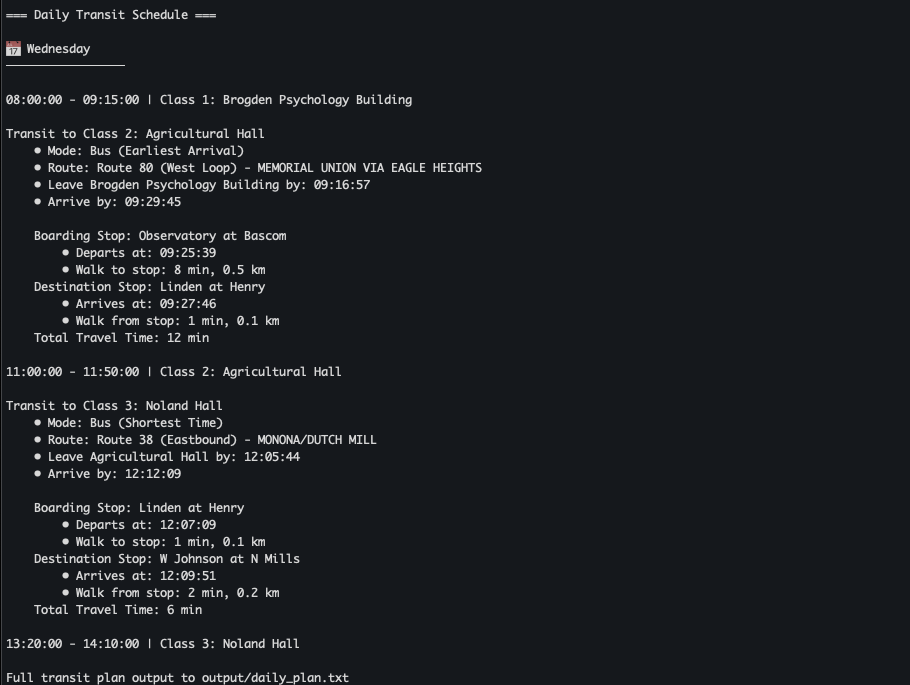

# Campus Transit Planner for UW-Madison


Campus Transit Planner is a Python-based command-line tool that helps UW-Madison students get to class on time by intelligently computing walking and bus routes between buildings based on their daily schedule. It integrates GTFS transit data from Madison's transit system and real-time Google Maps Distance Matrix API estimates to generate personalized, schedule-aware weekly transit plans.

The tool processes over 6,000 bus routes, 1,700 unique transit stops, and 280,000 stop times to identify the best possible travel paths between classes. It takes into account live schedule constraints, walking times, and transit availability to recommend time-sensitive and reliable trip plans. 

Designed for fast local use, this Campus Transit Planner brings real-world transit complexity into a focused academic planning tool—making it easier to show up on time, even on the busiest class days.

## Motivation
The idea for this project stemmed from my desire to create a practical tool that helps students like myself navigate complex transit systems efficiently. Managing tight class schedules alongside public transportation can be stressful and time-consuming, especially in large cities with extensive transit networks.

I knew software such as Google and Apple Maps was an easy option, though I wanted to provide a solution that could plan out personalized schedules for entire weeks and months rather than just one-time trips.

By developing an application that combines real-world transit data with class schedules, I aimed to simplify daily commuting and reduce travel uncertainty for students. This project is designed to be not only a personal solution but also a useful resource for university communities seeking to optimize their transit routes and improve on-time arrivals.

## Features
- Schedule Generation: Creates complete weekly transit schedules between classes using GTFS and walking data.
- Transit Filtering: Parses 280,000+ stop times and 6,000 routes to find valid weekday trips using GTFS calendar rules.
- Custom Routing Algorithm: Calculates optimal paths based on class times, proximity (Haversine), and route efficiency.
- Optimization Modes: Supports earliest arrival and shortest travel time for tight or flexible transfers.
- Walking Integration: Uses Google Maps API to estimate walk times between buildings and nearby bus stops.
- Building Matching: Supports string matching to resolve building name typos or partial input.
- CLI Output: Outputs detailed, easy-to-read daily schedules showing class times, trip plans, and departure info.
- Schedule Awareness: Handles overlapping class times, limited transfer windows, and multi-mode routing constraints.

## Table of Contents
- [Installation](#installation)
- [Quick Start](#quick-start)
- [Running the CLI](#running-the-cli)
- [Project Structure](#project-structure)
- [Data Sources](#data-sources)
- [Contributing](#contributing)
- [License](#license)
- [Roadmap](#roadmap)

## Installation

### Prerequisites
- Python 3.9+

### Setup
1. Clone the repository
```bash
git clone https://github.com/erik-larson01/campus-transit-planner.git
cd campus-transit-planner
```
2. Create and activate a virtual environment (optional but recommended)
```bash
python -m venv venv
source venv/bin/activate  # On Windows use: venv\Scripts\activate
```
3. Install dependencies
```bash
pip install -r requirements.txt
```
4. Set up your Google Maps API key

    1\. Go to the [Google Cloud Console](https://cloud.google.com/cloud-console?utm_source=google&utm_medium=cpc&utm_campaign=na-US-all-en-dr-bkws-all-all-trial-e-dr-1710134&utm_content=text-ad-none-any-DEV_c-CRE_764256462664-ADGP_Hybrid+%7C+BKWS+-+Mix+%7C+Txt+-+Generic+Cloud-Console-Cloud+Console-CLS+Test-KWID_43700082354594832-kwd-55675752867&utm_term=KW_google%20cloud%20console-ST_google+cloud+console&gad_source=1&gad_campaignid=22795873413&gclid=EAIaIQobChMIr8fCkt_ijgMVnDcIBR0-cCs1EAAYASAAEgKw_fD_BwE&gclsrc=aw.ds)

    2\. Create a new project or select an existing one

    3\. Navigate to APIs & Services → Library

    4\. Search for Distance Matrix API and enable it

    5\. Go to APIs & Services → Credentials

    7\. Click Create Credentials → API key

    7\. Copy your API key

    8\. Then, in your project directory, create a .env file and add:
    ```env
    GOOGLE_MAPS_API_KEY=your-api-key-here
    ```

## Quick Start

### 1\. Edit Your Class Schedule
- Open the data/class_schedule.txt file and format your classes using this structure:
```csv
course_code,class_name,day,start_time,end_time,building
NUTRI SCI 132, Nutrition Today, Monday, 11:00:00, 11:50:00, Agricultural Hall
COMP SCI 300, Programming II, Wednesday, 13:20:00, 14:10:00, Noland Hall
ECON 301, Intermediate Micro, Thursday, 14:30:00, 15:45:00, Ingraham Hall
```

- Ensure you are using 24 hour format in the form HH:MM:SS
- Ensure your building names closely align with those in [UW-Madion's campus map](map.wisc.edu)

### 2\.  Run the Program
- Run the CLI using:

```bash
python main.py
```
The planner will:
- Parse your schedule

- Match building names to coordinates

- Calculate walking and bus transit options between classes

- Prompt you to choose between the fastest or most convenient routes

### 3\. View the Output

- After running, your optimized weekly transit plan will be saved to `output/daily_plan.txt`
- It will also be printed to the terminal in a readable, day-by-day format.

## Running the CLI
Below is my `class_schedule.txt` on a given Wednesday, where one class is in Brogden Psychology Building is missing a part of the building title:
```
course_code,class_name,day,start_time,end_time,building
COMP SCI 252, Intro Comp Eng, Wednesday, 08:00:00, 09:15:00, Psychology Building
NUTRI SCI 132, Nutrition Today, Wednesday, 11:00:00, 11:50:00, Agricultural Hall
COMP SCI 300, Programming II, Wednesday, 13:20:00, 14:10:00, Noland Hall
```

I run the program with `python main.py`, and see how the building name will be matched to its correct name in the UW-Madison campus map:


After a max walking distance is set, the program generates the best two valid trips between the first two classes, as well as a walking only option:


The same is done for the second trip between the final two classes:


Finally, an entire daily plan (or weekly if there are classes on multiple days) is output:


## Project Structure
```
campus-transit-planner/
├── core/                          # Main application logic and modules
│   ├── __init__.py
│   ├── building_matcher.py        # Building name matching utilities
│   ├── cli.py                     # Command line interface
│   ├── gtfs_parser.py             # GTFS data parsing and filtering
│   ├── route_planner.py           # Routing algorithm and trip planning
│   └── schedule_parser.py         # Class schedule parsing and validation
├── data/                          # Input data files and GTFS feeds
│   ├── building.geojson           # GeoJSON file for campus buildings
│   ├── class_schedule.txt         # Class schedules input file
│   └── gtfs/                      # GTFS public transit data files
│       ├── calendar.txt
│       ├── routes.txt
│       ├── stop_times.txt
│       ├── stops.txt
│       └── trips.txt
├── output/                        # Generated schedule output files
│   └── daily_plan.txt             # Daily transit schedules generated by CLI
├── utils/                         # Helper utilities
│   ├── __init__.py
│   ├── distance_utils.py          # Distance calculations and Google API usage
│   └── time_utils.py              # Time parsing and manipulation utilities
├── README.md                      # Project overview and instructions
├── main.py                        # Main program entry point (CLI runner)
├── requirements.txt               # Python dependencies and versions
└── .gitignore                     # Git ignore rules
                  
```

## Data Sources
`buildings.geojson`: Extracted from the [UW-Madison Campus Map](map.wisc.edu) by converting building location data and API calls into GeoJSON format.

`gtfs/`: Public transit data sourced from [City of Madison Metro Transit GTFS feed]([https://transitdata.cityofmadison.com/GTFS/](https://www.cityofmadison.com/metro/business/information-for-developers))

## Contributing

I welcome contributions! Here's how you can help:

1.  Report Issues: Use GitHub Issues for bugs and feature requests
2.  Submit Pull Requests: Fork, create feature branch, and submit PR
3.  Suggest Features: Share ideas for new functionality
4.  Improve Documentation: Help make the docs better
   
## License
This project is licensed under the MIT License - see the [LICENSE](./LICENSE.txt) file for details.

## Roadmap
- Automated GTFS Updates: Fetch live GTFS data regularly to keep transit info current without manual file changes.

- Transit Visualization: Use deck.gl to create interactive maps showing routes, stops, and walking paths.

- Class Schedule Import: Support importing class schedules from CSV or university systems for easier setup.

- Real-Time Transit: Integrate GTFS-realtime data for dynamic route updates and accurate timing.

- Runtime Optimization: Move off of using the Google Maps API to improve runtime
